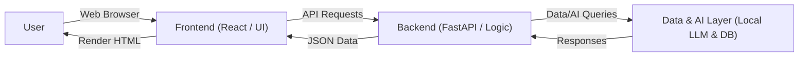
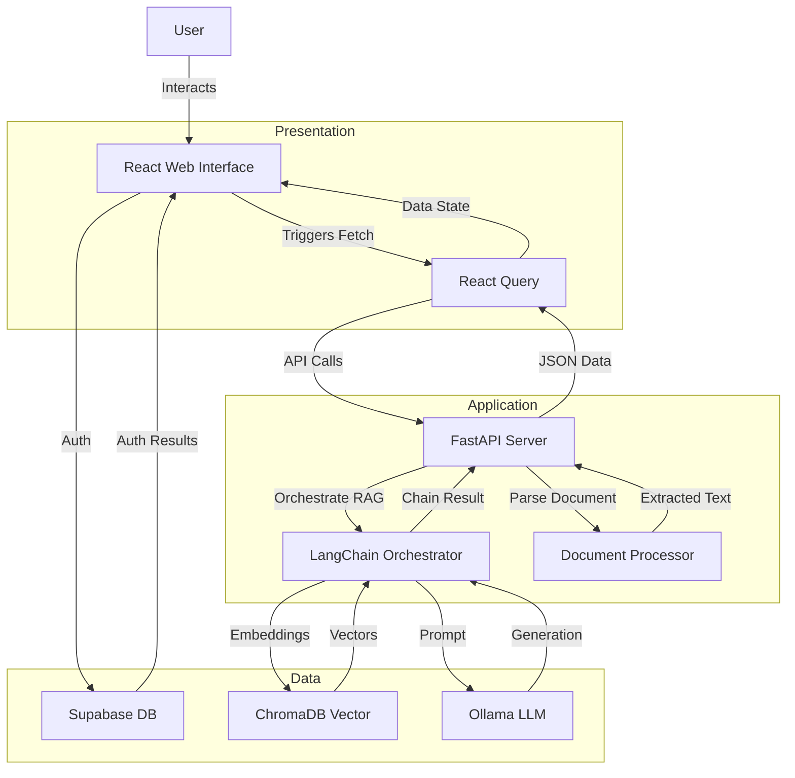

# Legal Sage AI - System Architecture

This document maps out the system architecture of the **Legal Sage AI** platform. It provides both a high-level conceptual overview and a detailed breakdown of components across the Presentation, Application, and Data layers.

## High-Level Architecture

The following diagram illustrates the broad conceptual flow of the application from the user to the foundational data systems.

## Detailed System Architecture

This section details the specific technologies and how data routes between micro-components within their respective architectural layers.

## Layer Breakdown

### 1. Presentation Layer (Frontend)
The user-facing side of the application, responsible for rendering the UI and handling user interaction.
- **Technologies:** React 18, TypeScript, Vite, Tailwind CSS, Shadcn/UI
- **Components:**
  - **React Web Interface:** Builds the responsive layout and components of the Legal Sage AI application.
  - **React Query:** Manages asynchronous state, caches responses, and seamlessly handles data fetching with the API backend.

### 2. Application Layer (Backend)
The core logic of the application. It exposes API routes, handles business logic, and orchestrates the AI functionalities.
- **Technologies:** Python, FastAPI, LangChain
- **Components:**
  - **FastAPI Server:** Provides the robust RESTful API offering endpoints like `/upload`, `/analyze`, `/chat`, and `/predict`.
  - **Document Processor:** Handles the initial ingestion and parsing of uploaded legal documents (Word, PDF).
  - **LangChain Orchestrator:** The intelligence bridge. Orchestrates workflows, sets up Retrieval-Augmented Generation (RAG) chains, formats prompts, and queries vector stores.

### 3. Data & Infrastructure Layer
Responsible for persisting user data, storing high-dimensional vectors, and running the open-source Large Language Models locally.
- **Technologies:** Supabase, ChromaDB, Ollama
- **Components:**
  - **Supabase:** Manages user authentication, securing endpoints, and optionally saving generalized user metadata.
  - **ChromaDB:** A dedicated vector database used for storing document embeddings, allowing the system to perform fast semantic searches during user chats.
  - **Ollama:** Serves local Large Language Models to generate summaries, make case predictions, and respond to user queries in real-time preserving data privacy.

## Component Interactions

1. **Authentication:** The Presentation Layer directly communicates with Supabase to authenticate users and establish valid sessions.
2. **File Processing Workflow:**
   - A user uploads a legal document. The **Presentation Layer** sends this file to the **FastAPI Server**.
   - The **FastAPI Server** delegates parsing tasks to the **Document Processor**.
   - Parsed text is relayed to the **LangChain Orchestrator**, which requests document embeddings from **Ollama**.
   - The embeddings are saved into **ChromaDB**.
3. **Chat & Insight Workflow (RAG):**
   - When a user asks a question, the **REST API** forwards the query to the **LangChain Orchestrator**.
   - **LangChain** queries **ChromaDB** for the most relevant context vectors related to the uploaded document.
   - The relevant contexts alongside the user's question are sent to the **Ollama** LLM.
   - The generated AI response is returned back up the stack to the **React UI**.
